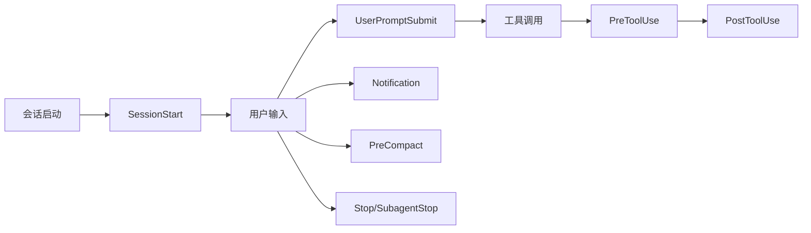
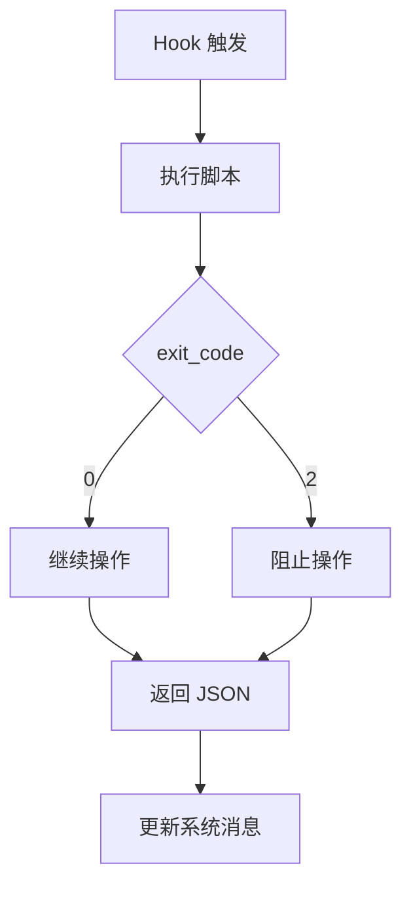
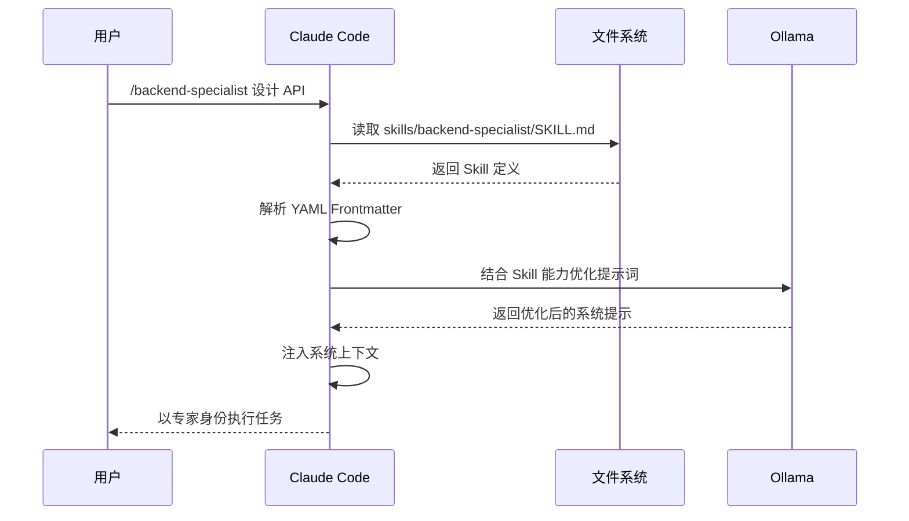

# Code Agent


**让 Claude Code 拥有项目感知能力的智能开发框架**

[快速开始](#-5分钟快速开始) · [文档](./project_document) · [示例](#-使用示例) 

</div>


---

## 🎯 这是什么？

**Claude Code Multi-Agent** 是一个为 [Claude Code](https://www.anthropic.com/) 设计的智能开发框架，通过 **Hooks 系统** 在会话生命周期中自动执行智能操作，让 Claude Code 从 "通用聊天助手" 升级为 "懂你项目的专业开发伙伴"。

### 核心定位

> **这不是一个插件生态，而是一个 Claude Code 的专属工作空间**  
> 你需要将仓库克隆后，将你的项目（或初始化项目）放在此文件夹中，即可享受智能 Hooks 定义以及 300+ Skills 方案。

---

## 😫 解决了什么痛点？

### 痛点 1：Claude Code 缺乏项目感知能力

**问题**：Claude Code 默认不知道你的项目是什么类型、使用什么框架、有什么依赖。每次都需要你手动描述项目背景。

**解决**：通过 **Ollama 智能引擎** 自动检测项目类型（Python/Node.js/Java 等）、识别框架（Django/FastAPI/React 等），并在会话启动时自动注入项目上下文。

### 痛点 2：需要手动配置各种工具和提示词

**问题**：每次使用 Claude Code 都需要：

- 手动告诉它项目结构
- 手动配置 Git 工作流
- 手动编写提示词模板
- 手动管理文档更新

**解决**：**零配置启动** - 克隆即用，所有配置通过 Hooks 自动完成。提示词模板化存储在 `prompts.json`，支持团队协作和版本控制。

### 痛点 3：缺乏智能的意图分析和技能推荐

**问题**：Claude Code 不知道什么时候该调用什么工具，也不知道有哪些可用的专家技能。

**解决**：**智能意图分析** - 自动判断任务复杂度，推荐合适的 MCP 工具（Sequential Thinking、Task Manager 等）和 Skills（后端专家、测试专家等）。

### 痛点 4：文档维护繁琐且容易遗忘

**问题**：代码改了，文档忘了更新。项目知识散落在聊天记录中，无法沉淀。

**解决**：**自动文档维护** - 每次代码修改后，强制提示更新 `DEVELOPMENT.md`、`KNOWLEDGE.md`、`CHANGELOG.md`，确保文档与代码同步。

---

## ✨ 核心优势

所有判断逻辑通过本地部署 **Ollama** 完成，无需编写复杂的规则引擎。提示词模板化存储在 `prompts.json`，支持持续调优和版本控制。

### 🎯 300+ Skills 专家智能体

会话启动时自动扫描并加载所有 Skills，包括：
- **后端专家** (`/backend-specialist`) - Django、FastAPI、Spring Boot 等
- **前端专家** (`/frontend-specialist`) - React、Vue、Next.js 等
- **测试专家** (`/testing-specialist`) - 单元测试、集成测试、E2E 测试
- **安全专家** (`/security-specialist`) - OWASP Top 10、安全审计
- **架构专家** (`/architecture-specialist`) - 系统设计、微服务架构
- **DevOps 专家** (`/devops-specialist`) - CI/CD、容器化、云部署
- ... 还有更多

### 📝 自动文档维护系统

强制维护三个核心文档：
- **DEVELOPMENT.md** - 开发工作文档（任务状态、进度跟踪）
- **KNOWLEDGE.md** - 项目知识库（技术决策、代码模式）
- **CHANGELOG.md** - 变更日志（版本记录、功能变更）

文档在会话启动时自动注入上下文，替代 Memory MCP，避免上下文爆炸。

### 🔄 Git 工作流智能集成

自动检测 Git 仓库配置，提示分支策略（github-flow / git-flow），确保团队协作规范。

### ⚡ 零配置启动

基于 **uv** 的依赖管理，无需手动安装 Python 包。克隆项目 → 配置环境变量 → 启动 Claude Code，即可使用。

---

## 🚀 5 分钟快速开始

### 前置要求

1. **Claude Code** - [Claude Desktop](https://claude.ai/download) 或 VS Code + Claude 扩展
2. **Ollama**（推荐）- 智能引擎核心，用于项目检测和意图分析
3. **uv**（推荐）- Python 依赖管理，比 pip 快 10 倍

### 步骤 1：安装依赖（2 分钟）

#### 安装 Ollama

```bash
# Windows
winget install Ollama.Ollama

# macOS
brew install ollama

# Linux
curl -fsSL https://ollama.com/install.sh | sh
```

#### 下载模型

```bash
# 轻量级模型，适合日常开发（推荐）
ollama pull gemma3:1b

# 可选：更强大的模型
ollama pull llama3.2:3b
```

#### 安装 uv

```bash
# Windows (PowerShell)
powershell -ExecutionPolicy ByPass -c "irm https://astral.sh/uv/install.ps1 | iex"

# macOS/Linux
curl -LsSf https://astral.sh/uv/install.sh | sh
```

### 步骤 2：克隆并配置项目（1 分钟）

```bash
# 克隆项目
git clone https://github.com/Prorise-cool/claude-code-multi-agent.git
cd claude-code-multi-agent

# 创建环境变量文件（如果不存在 .env.example，可跳过）
# cp .env.example .env

# 编辑 .env 文件（可选，默认配置已可用）
# OLLAMA_MODEL = gemma3:1b
```

### 步骤 3：启动测试（2 分钟）

#### 方式 1：在现有项目中测试

```bash
# 1. 将你的项目复制到此目录
cp -r /path/to/your/project ./your-project-name

# 2. 打开 Claude Code，选择此目录
# Claude Desktop: 直接打开文件夹
# VS Code: code .
```

#### 方式 2：创建新项目测试

```bash
# 1. 创建测试项目
mkdir test-project && cd test-project

# 2. 初始化 Python 项目（示例）
echo "print('Hello World')" > main.py
echo "requests==2.31.0" > requirements.txt

# 3. 打开 Claude Code，选择 test-project 目录
```

### 步骤 4：验证安装

打开 Claude Code 后，在聊天框中输入任意消息，你应该看到：

1. ✅ **项目类型检测** - 系统自动识别项目类型（如 "项目类型: Python"）
2. ✅ **Skills 加载** - 显示已加载的 Skills 数量（如 "已加载 50 个 Skills"）
3. ✅ **文档初始化** - 自动创建 `project_document/` 目录和三个核心文档

**如果看到这些信息，说明安装成功！** 🎉

### 快速测试命令

```bash
# 测试 1：查看可用 Skills
# 在 Claude Code 中输入：列出所有可用的 Skills

# 测试 2：测试项目检测
# 在 Claude Code 中输入：我的项目是什么类型？

# 测试 3：测试 Skills 调用
# 在 Claude Code 中输入：/backend-specialist 如何设计 RESTful API？

# 测试 4：测试文档维护
# 修改任意代码文件，系统会自动提示更新文档
```

---

## 📖 详细安装指南

### 为什么需要 Ollama？

Ollama 是本项目的 "大脑"，负责：
- **项目类型检测**：自动识别你的项目是 Python/Node.js/Java 等
- **意图分析**：理解用户输入，判断是简单查询还是复杂任务
- **提示词优化**：将模糊需求转化为清晰的执行计划
- **技能推荐**：根据任务类型推荐合适的 Skills

没有 Ollama，系统会降级到基础模式（仅支持手动触发 Skills）。

> 📖 **详细配置教程**：[Ollama 配置指南](./project_document/tutorial-ollama-setup.md)

### 为什么需要 uv？

uv 是 Rust 编写的超快 Python 包管理器，本项目用它来：
- **自动管理 Python 环境**：无需手动创建虚拟环境
- **秒级安装依赖**：比 pip 快 10-100 倍
- **零配置运行 Hooks**：`uv run` 自动处理依赖隔离

> 💡 **为什么不用 pip？** uv 会自动创建隔离环境，避免污染全局 Python 环境，且速度快 10 倍以上。

### 环境变量配置（可选）

如果项目根目录存在 `.env.example`，可以复制并编辑：

```bash
cp .env.example .env
```

编辑 `.env` 文件：

```bash
# Ollama 模型配置
OLLAMA_MODEL=gemma3:1b

# TTS 语音播报（可选）
HOOKS_TTS_ENABLED=false
HOOKS_TTS_PROVIDER=pyttsx3
```

**首次启动时，`SessionStart` Hook 会自动：**
- ✅ 检测项目类型（通过 Ollama）
- ✅ 扫描并加载所有 Skills（300+ 个）
- ✅ 初始化文档系统（`DEVELOPMENT.md`、`KNOWLEDGE.md`、`CHANGELOG.md`）
- ✅ 检查 Git 配置并提示工作流设置

---

## 💡 使用示例

### 示例 1：自动项目检测

**场景**：你打开了一个新的 Python 项目，想了解项目结构。

**操作**：直接打开 Claude Code，系统会自动：
1. ✅ 检测项目类型（Python + FastAPI）
2. ✅ 识别框架和依赖
3. ✅ 加载相关 Skills（后端专家、测试专家等）
4. ✅ 初始化项目文档

**结果**：Claude Code 立即了解你的项目，无需手动介绍。

---

### 示例 2：调用专家 Skills

**场景**：需要设计 RESTful API，但不确定最佳实践。

**操作**：在 Claude Code 中输入：

```
/backend-specialist 设计用户认证的 RESTful API
```

**结果**：Claude Code 以 "后端专家" 身份回答，参考 FastAPI/Django 最佳实践，提供：
- ✅ RESTful 资源设计
- ✅ HTTP 方法选择
- ✅ 状态码定义
- ✅ 请求/响应格式

---

### 示例 3：智能意图分析

**场景**：输入一个复杂任务："实现用户登录功能"

**操作**：系统自动分析意图，推荐：
- ✅ **推荐工具**：Sequential Thinking（复杂任务分解）
- ✅ **推荐 Skills**：`/backend-specialist`、`/security-specialist`
- ✅ **执行计划**：自动生成任务拆解建议

**结果**：无需手动思考 "该用什么工具"，系统智能推荐。

---

### 示例 4：自动文档维护

**场景**：修改了 `user_service.py`，添加了新功能。

**操作**：系统自动检测代码变更，强制提示更新：
- ✅ **DEVELOPMENT.md** - 记录开发进度
- ✅ **KNOWLEDGE.md** - 记录技术决策
- ✅ **CHANGELOG.md** - 记录变更历史

**结果**：文档始终与代码同步，项目知识可沉淀。

---

### 示例 5：Commands 工作流

**Commands** 是预定义的工作流，通过 `/command-name` 触发：

```bash
# 创建功能规格（从需求到实施计划）
/kiro/spec 用户认证功能

# 执行完整的代理工作流
/agent-workflow 实现博客系统

# Git 提交（自动生成 Commit Message）
/gh/commit
```

**Command 示例：`/kiro/spec`**

这个 Command 会引导你完成：
1. **需求收集**：生成 EARS 格式的需求文档
2. **设计文档**：创建架构设计和数据模型
3. **任务列表**：拆解为可执行的开发任务

所有文档自动保存到 `.kiro/specs/{feature_name}/` 目录。

> 📖 **详细说明**：查看 [`.claude/commands/kiro/spec.md`](./.claude/commands/kiro/spec.md)

---

## 🏗️ 系统架构

### Hooks 工作原理

本项目通过 Python Hooks 系统管理 Claude Code 的会话生命周期。每个 Hook 在特定事件触发时执行，通过 Ollama 进行智能决策。

**核心设计理念：**
- ✅ **文档驱动**：强制维护三个核心文档（DEVELOPMENT.md、KNOWLEDGE.md、CHANGELOG.md），会话启动时自动读取并注入上下文
- ✅ **配置化提示词**：所有提示词模板存储在 `.claude/hooks/prompts.json`，用户可自由调整和优化
- ✅ **去 Memory 中间层**：不再依赖 Memory MCP，直接通过文档维护项目知识，避免上下文爆炸导致的指令失效

#### Hook 触发时机



#### Hook 执行流程

每个 Hook 通过 `exit_code` 控制后续操作：



**返回值格式：**

```json
{
    "exit_code": 0,
    "message": "操作成功",
    "data": {
        "skills": ["backend-specialist", "testing-specialist"],
        "project_type": "Python",
        "framework": "FastAPI"
    }
}
```

- `exit_code=0`：允许操作继续
- `exit_code=2`：阻止操作（如检测到危险命令）

---

#### Hook 类型说明

| Hook | 触发时机 | 核心功能 | Ollama 作用 |
|------|---------|---------|------------|
| **SessionStart** | 会话启动 | 项目初始化 | 检测项目类型、推荐 Skills |
| **UserPromptSubmit** | 用户提交输入 | 意图分析 | 判断任务复杂度、优化提示词 |
| **PreToolUse** | 工具调用前 | 权限检查 | 评估操作风险 |
| **PostToolUse** | 工具调用后 | 文档更新 | 生成文档更新建议 |
| **Stop** | 会话结束 | 清理资源 | - |
| **SubagentStop** | 子代理停止 | 子任务处理 | - |
| **PreCompact** | 上下文压缩前 | 信息保留 | 识别重要上下文 |
| **Notification** | 系统通知 | 消息处理 | - |

**核心 Hook 详解：**

**1. SessionStart - 会话启动处理器**

这是最重要的 Hook，负责项目初始化：

```python
# .claude/hooks/handlers/session_start.py 的核心逻辑

# 1. 调用 Ollama 检测项目类型
project_info = ollama_client.detect_project_type()
# 返回：{"type": "Python", "framework": "FastAPI", "version": "3.11"}

# 2. 扫描 skills/ 目录
skills = scan_skills_directory()
# 返回：["backend-specialist", "testing-specialist", ...]

# 3. 初始化文档系统
document_manager.init_documents()
# 创建：DEVELOPMENT.md, KNOWLEDGE.md, CHANGELOG.md

# 4. 【核心改进】强制读取三个文档并注入上下文
development_content = read_file("project_document/DEVELOPMENT.md")
knowledge_content = read_file("project_document/KNOWLEDGE.md")
changelog_content = read_file("project_document/CHANGELOG.md")
# 将这些内容注入到系统上下文中，替代 Memory MCP

# 5. 检查 Git 配置
git_status = check_git_config()
# 检查：.gitignore, 分支策略
```

**2. UserPromptSubmit - 意图识别处理器**

分析用户输入，提供智能建议：

```python
# 用户输入："帮我实现用户登录功能"

# Ollama 分析结果：
{
    "intent": "feature_implementation",
    "complexity": "medium",
    "recommended_tools": ["Write", "Edit", "Bash"],
    "recommended_skills": ["backend-specialist", "security-specialist"],
    "suggested_plan": [
        "1. 设计数据库表结构",
        "2. 实现认证逻辑",
        "3. 编写单元测试",
        "4. 添加安全防护"
    ]
}
```

**3. PostToolUse - 工具使用后处理器**

在每次代码修改后，**强制** 更新三个文档：

```python
# 检测到修改了 user_service.py

# 【强制】必须更新以下文档：
# 1. DEVELOPMENT.md - 记录开发进度和任务状态
# 2. KNOWLEDGE.md - 记录技术决策和代码模式
# 3. CHANGELOG.md - 记录变更历史

# 文档更新提示通过 prompts.json 配置，用户可自定义格式和要求
```

**提示词配置化：**
所有提示词模板存储在 `.claude/hooks/prompts.json`，支持：
- 自定义提示词内容和格式
- 使用 `{变量}` 占位符动态替换
- 按 Hook 类型分组管理
- 便于持续调优和版本控制

> 📖 **Hook 开发指南**：查看 [`.claude/hooks/core/base_hook.py`](./.claude/hooks/core/base_hook.py)

---

### Skills 触发机制

Skills 是本项目的 "专家团队"，每个 Skill 代表一个专业领域的智能体。

#### Skills 加载流程



#### Skill 目录结构

```
.claude/skills/
├── backend-specialist/
│   ├── SKILL.md                    # Skill 定义（必需）
│   └── references/                 # 参考文档（可选）
│       ├── cursor_rules_django.md
│       ├── cursor_rules_fastapi.md
│       └── restful_best_practices.md
├── testing-specialist/
│   ├── SKILL.md
│   └── references/
│       ├── pytest_guide.md
│       └── test_patterns.md
└── security-specialist/
    ├── SKILL.md
    └── references/
        ├── owasp_top10.md
        └── secure_coding.md
```

---

#### SKILL.md 格式规范

每个 Skill 必须包含 YAML Frontmatter 和 Markdown 内容：

```markdown
---
name: backend-specialist
description: 提供后端开发、API 设计、数据库交互能力
version: 1.0.0
author: Prorise
---

# Backend Specialist

后端开发专家，擅长 API 设计和数据库优化。

## When to Use This Skill

- 设计 RESTful API
- 实现业务逻辑
- 优化数据库查询
- 处理认证授权

## Capabilities

### Django Backend Expert
Django 后端开发专家，精通 Models、Views、Services。

📖 [Django 最佳实践](./references/cursor_rules_django.md)

### FastAPI Expert
FastAPI 高性能 API 开发专家。

📖 [FastAPI 开发指南](./references/cursor_rules_fastapi.md)
```

---

#### Skill 示例

<details>
<summary> <b> 示例 1：code-review（代码审查助手）</b> </summary>

```markdown
---
name: code-review
description: 代码审查助手，检测代码质量和安全问题
version: 1.0.0
---

# Code Review Skill

自动化代码审查工具，帮助你在提交前发现问题。

## When to Use This Skill

- 提交 PR 前的自检
- 重构代码时的风险评估
- Code Review 流程自动化

## Capabilities

### 静态分析
扫描代码中的常见问题：
- 未处理的异常
- 硬编码的配置
- 性能瓶颈
- 代码重复

📖 [静态分析规则](./references/static-analysis.md)

### 安全检查
检测潜在的安全漏洞：
- SQL 注入风险
- XSS 漏洞
- 敏感信息泄露
- 不安全的依赖

📖 [安全检查清单](./references/security-checklist.md)

### 代码风格
检查代码规范：
- PEP 8 (Python)
- ESLint (JavaScript)
- Google Style Guide (Java)

📖 [代码风格指南](./references/style-guide.md)
```

</details>

<details>
<summary> <b> 示例 2：test-generator（测试用例生成器）</b> </summary>

```markdown
---
name: test-generator
description: 测试用例生成器，自动生成单元测试和集成测试
version: 1.0.0
author: Prorise
---

# Test Generator Skill

根据代码自动生成单元测试，提高测试覆盖率。

## When to Use This Skill

- 新功能开发完成后
- 重构代码需要补充测试
- 提高测试覆盖率

## Capabilities

### 单元测试生成
支持多种测试框架：
- pytest (Python)
- Jest (JavaScript)
- JUnit (Java)

自动生成：
- 正常用例
- 边界用例
- 异常用例

📖 [测试框架配置](./references/frameworks.md)

### 边界用例分析
自动识别边界条件：
- 空值处理（None、null、undefined）
- 异常输入（负数、超长字符串）
- 并发场景（竞态条件、死锁）

📖 [边界用例模板](./references/test-templates.md)

### 覆盖率报告
生成测试覆盖率分析：
- 行覆盖率
- 分支覆盖率
- 函数覆盖率

📖 [覆盖率报告格式](./references/coverage-report.md)
```

</details>

<details>
<summary> <b> 示例 3：api-designer（API 设计助手）</b> </summary>

```markdown
---
name: api-designer
description: RESTful API 设计助手，符合行业最佳实践
version: 2.0.0
author: Prorise
dependencies:
  - openapi-generator
  - swagger-ui
---

# API Designer Skill

设计符合 RESTful 规范的 API，自动生成 OpenAPI 文档。

## When to Use This Skill

- 新项目 API 设计
- 现有 API 重构
- OpenAPI 文档生成
- API 版本管理

## Capabilities

### 资源建模
设计 RESTful 资源：
- 资源命名规范（复数形式、小写、连字符）
- HTTP 方法选择（GET/POST/PUT/PATCH/DELETE）
- 状态码定义（2xx/4xx/5xx）
- 请求/响应格式（JSON Schema）

📖 [RESTful 最佳实践](./references/restful-guide.md)

### 文档生成
自动生成 API 文档：
- OpenAPI 3.0 规范
- Swagger UI 集成
- 示例代码生成（curl、Python、JavaScript）
- Postman Collection 导出

📖 [OpenAPI 文档模板](./references/openapi-template.md)

### 版本管理
API 版本控制策略：
- URL 版本控制（`/v1/users`）
- Header 版本控制（`Accept: application/vnd.api+json; version=1`）
- 兼容性检查（Breaking Changes 检测）
- 废弃策略（Deprecation Notice）

📖 [版本管理策略](./references/versioning.md)

### 安全设计
API 安全机制：
- 认证方案（OAuth2/JWT/API Key）
- 权限控制（RBAC/ABAC）
- 限流策略（Rate Limiting）
- CORS 配置

📖 [API 安全配置](./references/security.md)
```

</details>

<details>
<summary> <b> 示例 4：database-optimizer（数据库优化助手）</b> </summary>

```markdown
---
name: database-optimizer
description: 数据库性能优化助手，分析慢查询和索引设计
version: 1.0.0
author: Prorise
---

# Database Optimizer Skill

分析和优化数据库性能，解决慢查询问题。

## When to Use This Skill

- 慢查询优化
- 索引设计
- 数据库架构评审
- 性能瓶颈排查

## Capabilities

### 查询分析
分析 SQL 性能：
- 执行计划解读（EXPLAIN）
- 索引使用情况
- 查询重写建议
- N+1 查询检测

📖 [查询优化指南](./references/query-optimization.md)

### 索引设计
索引策略建议：
- 单列索引 vs 复合索引
- 覆盖索引（Covering Index）
- 索引失效场景（函数、类型转换）
- 索引维护成本

📖 [索引设计最佳实践](./references/index-design.md)

### 架构优化
数据库架构改进：
- 表结构设计（范式化 vs 反范式化）
- 分库分表策略（垂直拆分、水平拆分）
- 读写分离（主从复制）
- 缓存策略（Redis、Memcached）

📖 [数据库架构方案](./references/architecture.md)
```

</details>

<details>
<summary> <b> 示例 5：doc-writer（技术文档生成器）</b> </summary>

```markdown
---
name: doc-writer
description: 技术文档生成器，自动生成项目文档
version: 1.0.0
author: Prorise
---

# Doc Writer Skill

自动生成项目文档，保持文档与代码同步。

## When to Use This Skill

- 项目初始化
- 功能开发完成
- 文档更新
- API 文档生成

## Capabilities

### README 生成
生成项目 README：
- 项目介绍
- 快速开始
- 安装指南
- API 文档
- 贡献指南

📖 [README 模板](./references/readme-template.md)

### 代码注释
自动补充注释：
- 函数说明（Docstring）
- 参数描述（类型、默认值）
- 返回值说明
- 异常说明

📖 [注释规范](./references/comment-style.md)

### 变更日志
生成 CHANGELOG：
- 版本记录
- 功能变更
- Bug 修复
- 破坏性更新

📖 [变更日志格式](./references/changelog-format.md)
```

</details>

---

## 📁 项目结构

```
claude-code-multi-agent/
├── .claude/
│   ├── hooks/                      # Python Hooks 系统
│   │   ├── core/                   # 核心模块
│   │   │   ├── base_hook.py        # Hook 基类
│   │   │   ├── ollama_client.py    # Ollama 客户端
│   │   │   ├── document_manager.py # 文档管理器
│   │   │   ├── config.py           # 配置管理
│   │   │   └── logger.py           # 日志记录
│   │   ├── handlers/               # Hook 处理器
│   │   │   ├── session_start.py    # 会话启动
│   │   │   ├── user_prompt_submit.py # 提示分析
│   │   │   └── post_tool_use.py    # 工具使用后处理
│   │   ├── session_start.py        # SessionStart 入口
│   │   ├── user_prompt_submit.py   # UserPromptSubmit 入口
│   │   └── post_tool_use.py        # PostToolUse 入口
│   ├── commands/                   # Commands 定义
│   │   ├── kiro/
│   │   │   └── spec.md             # 功能规格创建工作流
│   │   ├── agent-workflow/
│   │   │   └── workflow.md         # 代理工作流
│   │   └── gh/
│   │       └── commit.md           # Git 提交工作流
│   ├── skills/                     # Skills 定义
│   │   ├── backend-specialist/
│   │   ├── frontend-specialist/
│   │   ├── testing-specialist/
│   │   ├── security-specialist/
│   │   └── ...
│   └── settings.json               # Hooks 配置
├── project_document/               # 自动维护的文档
│   ├── DEVELOPMENT.md              # 开发工作文档
│   ├── KNOWLEDGE.md                # 项目知识库
│   ├── CHANGELOG.md                # 变更日志
│   ├── tutorial-ollama-setup.md    # Ollama 配置教程
│   └── tutorial-collaboration-paradigm.md # 协作范式教程
├── .env.example                    # 环境变量示例
├── pyproject.toml                  # uv 依赖配置
└── README.md                       # 本文件
```

---

## 📚 文档

### 核心文档

- **[Ollama 配置教程](./project_document/tutorial-ollama-setup.md)** - 详细的 Ollama 安装和模型配置指南
- **[协作范式教程](./project_document/tutorial-collaboration-paradigm.md)** - 理解本项目的协作理念和工作流程
- **[开发文档](./project_document/DEVELOPMENT.md)** - 当前开发进度和待办事项
- **[项目知识库](./project_document/KNOWLEDGE.md)** - 项目的技术决策和最佳实践

### 技术文档

- **[Hook 开发指南](./.claude/hooks/core/base_hook.py)** - 如何开发自定义 Hook
- **[Skill 开发指南](./.claude/skills/)** - 如何创建新的 Skill
- **[Command 开发指南](./.claude/commands/)** - 如何定义工作流 Command

---

## 🔧 配置说明

### 环境变量配置

编辑 `.env` 文件：

```bash
# ==== = Ollama 模型配置 ==== =
OLLAMA_MODEL=gemma3:1b

# 可选：使用更强大的模型
# OLLAMA_MODEL = llama3.2:3b

# ==== = TTS(文本转语音)配置 ==== =
# TTS 提供商: pyttsx3(本地，无需 API)、openai、elevenlabs
HOOKS_TTS_PROVIDER=pyttsx3

# 是否启用 TTS 语音播报: true 或 false
HOOKS_TTS_ENABLED=false
```

### Hooks 配置

编辑 `.claude/settings.json`：

```json
{
  "permissions": {
    "allow": [
      "Bash(mkdir:*)",
      "Bash(uv:*)",
      "Write",
      "Edit",
      "Bash(chmod:*)"
    ]
  },
  "hooks": {
    "SessionStart": [
      {
        "type": "command",
        "command": "uv run .claude/hooks/session_start.py"
      }
    ],
    "UserPromptSubmit": [
      {
        "type": "command",
        "command": "uv run .claude/hooks/user_prompt_submit.py"
      }
    ],
    "PostToolUse": [
      {
        "type": "command",
        "command": "uv run .claude/hooks/post_tool_use.py"
      }
    ]
  }
}
```

### 提示词配置（重要）

**所有提示词模板已配置化**，存储在 `.claude/hooks/prompts.json`，你可以自由调整和优化：

```json
{
  "session_start": {
    "skills_hint_header": "可用 Skills（使用 /skill-name 调用）:",
    "project_type_label": "\n项目类型: {type}",
    ...
  },
  "user_prompt_submit": {
    "sequential_thinking_guidance": "【重要】这是一个复杂任务...",
    ...
  },
  "post_tool_use": {
    "document_update_header": "【强制】必须更新以下文档...",
    ...
  },
  "ollama": {
    "analyze_intent": "分析这个用户输入，返回 JSON：...",
    ...
  }
}
```

**配置优势：**
- ✅ **可调优**：根据实际效果持续优化提示词
- ✅ **可版本控制**：提示词变更纳入 Git 管理
- ✅ **团队协作**：统一团队提示词规范
- ✅ **支持变量**：使用 `{变量名}` 占位符动态替换

**修改提示词后无需重启**，下次 Hook 执行时自动加载最新配置。

---

## 🤝 贡献

欢迎贡献！我们期待你的 Pull Request。

### 贡献方式

1. **Fork 本仓库**
2. **创建特性分支**
   ```bash
   git checkout -b feature/AmazingFeature
   ```
3. **提交更改**
   ```bash
   git commit -m 'Add some AmazingFeature'
   ```
4. **推送到分支**
   ```bash
   git push origin feature/AmazingFeature
   ```
5. **开启 Pull Request**

### 贡献指南

- **Bug 报告**：使用 [Issue 模板](https://github.com/Prorise-cool/claude-code-multi-agent/issues/new) 提交
- **功能建议**：在 [Discussions](https://github.com/Prorise-cool/claude-code-multi-agent/discussions) 中讨论
- **代码贡献**：遵循项目的代码风格和提交规范
- **文档改进**：修正错误或补充说明

### 开发环境设置

```bash
# 1. 克隆仓库
git clone https://github.com/Prorise-cool/claude-code-multi-agent.git
cd claude-code-multi-agent

# 2. 安装依赖
uv sync

# 3. 运行测试
uv run pytest

# 4. 启动开发模式
uv run python -m claude_hooks.dev
```

---

## 🐛 常见问题

### Q1: Ollama 连接失败怎么办？

**问题**：Hook 执行时提示 `Connection refused` 或 `Ollama not running`

**解决方案**：

```bash
# 1. 检查 Ollama 是否运行
ollama list

# 2. 如果未运行，启动 Ollama 服务
# Windows: 从开始菜单启动 Ollama
# macOS/Linux:
ollama serve

# 3. 验证模型是否下载
ollama pull gemma3:1b
```

### Q2: uv 命令找不到？

**问题**：执行 `uv run` 时提示 `command not found`

**解决方案**：

```bash
# 1. 重新安装 uv
curl -LsSf https://astral.sh/uv/install.sh | sh

# 2. 添加到 PATH（如果安装后仍找不到）
# 在 ~/.bashrc 或 ~/.zshrc 中添加：
export PATH="$HOME/.cargo/bin:$PATH"

# 3. 重新加载配置
source ~/.bashrc  # 或 source ~/.zshrc
```

### Q3: Hook 执行失败，如何调试？

**问题**：Hook 执行时没有输出或报错

**解决方案**：

```bash
# 1. 手动执行 Hook 查看详细错误
uv run .claude/hooks/session_start.py

# 2. 查看日志文件
cat .claude/logs/hooks.log

# 3. 启用调试模式（编辑 .env）
DEBUG=true
```

### Q4: Skills 无法加载？

**问题**：输入 `/skill-name` 后提示 Skill 不存在

**解决方案**：

```bash
# 1. 检查 Skill 目录结构
ls -la .claude/skills/skill-name/

# 2. 确保 SKILL.md 存在且格式正确
cat .claude/skills/skill-name/SKILL.md

# 3. 重启会话，触发 SessionStart Hook 重新扫描
```

### Q5: 如何切换 Ollama 模型？

**问题**：想使用更强大的模型

**解决方案**：

```bash
# 1. 下载新模型
ollama pull llama3.2:3b

# 2. 修改 .env 文件
OLLAMA_MODEL=llama3.2:3b

# 3. 重启 Claude Code 会话
```

---

## 📊 性能优化建议

### Ollama 模型选择

| 模型 | 大小 | 速度 | 准确率 | 推荐场景 |
|------|------|------|--------|---------|
| `gemma3:1b` | 1.2GB | ⚡⚡⚡ | ⭐⭐⭐ | 日常开发、快速响应 |
| `llama3.2:3b` | 3.2GB | ⚡⚡ | ⭐⭐⭐⭐ | 复杂任务、高准确率 |
| `qwen2.5:7b` | 7.6GB | ⚡ | ⭐⭐⭐⭐⭐ | 生产环境、关键决策 |

### Hook 性能优化

```python
# 在 .claude/hooks/core/config.py 中配置

# 1. 启用缓存（避免重复调用 Ollama）
ENABLE_CACHE = True
CACHE_TTL = 3600  # 缓存 1 小时

# 2. 异步执行（不阻塞主流程）
ASYNC_HOOKS = ["PostToolUse", "Notification"]

# 3. 超时设置（避免长时间等待）
OLLAMA_TIMEOUT = 30  # 30 秒超时
```

---

## 🔒 安全说明

### 敏感信息保护

本项目不会收集或上传任何敏感信息：

- ✅ **本地运行**：所有 Hook 和 Ollama 调用均在本地执行
- ✅ **无网络请求**：除了 Ollama API（本地），不发送任何外部请求
- ✅ **代码隔离**：通过 uv 虚拟环境隔离依赖

### 权限说明

`.claude/settings.json` 中的权限配置：

```json
{
  "permissions": {
    "allow": [
      "Bash(mkdir:*)",      // 创建目录（用于初始化文档）
      "Bash(uv:*)",         // 执行 uv 命令（运行 Hooks）
      "Write",              // 写入文件（生成文档）
      "Edit",               // 编辑文件（更新代码）
      "Bash(chmod:*)"       // 修改权限（设置脚本可执行）
    ]
  }
}
```

**为什么需要这些权限？**

- `Bash(mkdir:*)` - 创建 `project_document/` 目录
- `Bash(uv:*)` - 运行 Python Hooks
- `Write/Edit` - 自动更新文档和代码
- `Bash(chmod:*)` - 确保 Hook 脚本可执行

---

## 🌟 致谢

本项目的灵感和技术来源于以下优秀项目：

- **[Ollama](https://ollama.com/)** - 本地 LLM 运行时，提供智能引擎支持
- **[Claude Code](https://www.anthropic.com/)** - AI 编程助手，提供 Hooks 系统
- **[uv](https://github.com/astral-sh/uv)** - 超快的 Python 包管理器
- **[RIPER-5 协议](./project_document/tutorial-collaboration-paradigm.md)** - 多代理协作范式

### 贡献者

感谢所有为本项目做出贡献的开发者：

<a href="https://github.com/Prorise-cool/claude-code-multi-agent/graphs/contributors">
  
</a>

---

## 📄 许可证

本项目采用 MIT 许可证 - 查看 [LICENSE](LICENSE) 文件了解详情。

```
MIT License

Copyright (c) 2025 Prorise

Permission is hereby granted, free of charge, to any person obtaining a copy
of this software and associated documentation files (the "Software"), to deal
in the Software without restriction, including without limitation the rights
to use, copy, modify, merge, publish, distribute, sublicense, and/or sell
copies of the Software, and to permit persons to whom the Software is
furnished to do so, subject to the following conditions:

The above copyright notice and this permission notice shall be included in all
copies or substantial portions of the Software.

THE SOFTWARE IS PROVIDED "AS IS", WITHOUT WARRANTY OF ANY KIND, EXPRESS OR
IMPLIED, INCLUDING BUT NOT LIMITED TO THE WARRANTIES OF MERCHANTABILITY,
FITNESS FOR A PARTICULAR PURPOSE AND NONINFRINGEMENT. IN NO EVENT SHALL THE
AUTHORS OR COPYRIGHT HOLDERS BE LIABLE FOR ANY CLAIM, DAMAGES OR OTHER
LIABILITY, WHETHER IN AN ACTION OF CONTRACT, TORT OR OTHERWISE, ARISING FROM,
OUT OF OR IN CONNECTION WITH THE SOFTWARE OR THE USE OR OTHER DEALINGS IN THE
SOFTWARE.
```

---

## 🚀 路线图

### v1.0.0（当前版本）

- ✅ 基础 Hooks 系统
- ✅ Ollama 集成
- ✅ Skills 自动发现
- ✅ Commands 工作流
- ✅ 自动文档维护

### v1.1.0（计划中）

- ⏳ 多语言支持（英文、中文）

---

## 📞 联系方式

- **作者**：[@Prorise-cool](https://github.com/Prorise-cool)
- **项目主页**：[GitHub](https://github.com/Prorise-cool/claude-code-multi-agent)
- **问题反馈**：[Issues](https://github.com/Prorise-cool/claude-code-multi-agent/issues)
- **讨论区**：[Discussions](https://github.com/Prorise-cool/claude-code-multi-agent/discussions)

---

<div align="center">

**Made with ❤️ by [@Prorise-cool](https://github.com/Prorise-cool)**

如果这个项目对你有帮助，请给个 ⭐ Star 支持一下！

[⬆ 回到顶部](#-claude-code-multi-agent)
